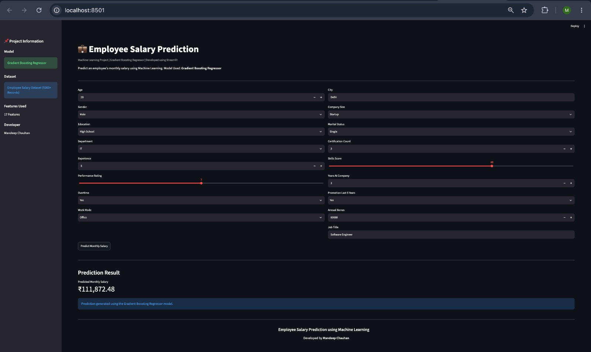

# 💼 Employee Salary Prediction

A Machine Learning project that predicts an employee's monthly salary based on professional and personal attributes.

---

## 📌 Project Overview

This project uses multiple Machine Learning regression algorithms to predict employee salaries.

The best-performing model is **Gradient Boosting Regressor**.

## Application Preview



---

## 📊 Dataset

- Total Records: 5000+
- Synthetic Dataset
- Missing Values
- Duplicate Records
- Outliers

Target Variable:

- Monthly_Salary

---

## 🛠 Features

- Age
- Gender
- Education
- Department
- Job Title
- Experience
- Performance Rating
- Overtime
- Work Mode
- City
- Company Size
- Marital Status
- Certification Count
- Skills Score
- Years At Company
- Promotion Last 5 Years
- Annual Bonus

---

## 📈 Models Used

- Linear Regression
- Decision Tree Regressor
- Random Forest Regressor
- Extra Trees Regressor
- Gradient Boosting Regressor

---

## 🏆 Best Model

Gradient Boosting Regressor

Performance:

- MAE: 11,118
- RMSE: 25,052
- R² Score: 0.7411

---

## 💻 Technologies Used

- Python
- Pandas
- NumPy
- Matplotlib
- Seaborn
- Scikit-learn
- Streamlit
- Joblib

---

## 🚀 Run the Project

Install dependencies

```bash
pip install -r requirements.txt
```

Run Streamlit

```bash
streamlit run app.py
```

---

## 📂 Project Structure

```text
Employee_Salary_Analytics/
│
├── app.py
├── requirements.txt
├── README.md
│
├── data/
├── images/
├── model/
└── notebook/
```

---

## 👨‍💻 Developer

**Mandeep Chauhan**

Python Backend Developer | Aspiring Data Scientist